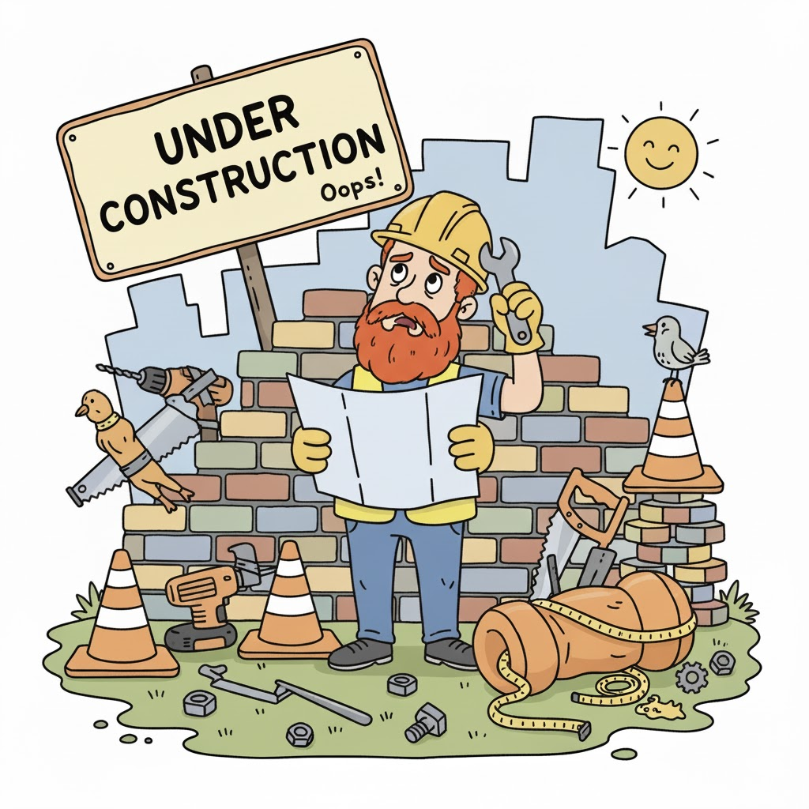

# All about Mattnew V. Cannon

This is under construction. Have a poorly made AI image:

## Training

## Computational skills

- Familiar with best practice concepts for software engineering such as modularity, documentation, testing, version control, etc.
- Comfortable working with large datasets
- High level expertise with R, bash and perl
- Moderate capabilities working with python
- Comfortable working with linux in an HPC environment
- Experience with a variety of bioinformatics commandline tools such as samtools, bowtie2, hisat2, qiime, awk, etc.
- Some experience with containerization using singularity and docker
- Experience with version control using git and github
- Some experience with machine learning approaches such as neural networks and random forests
- I don't generally think of this as machine learning, (though apparently it is) but I have a lot of experience with statistical modeling using linear models, mixed models, PCA, clustering and other approaches
- Some experience with cloud computing using AWS
- Extensive experience working with genomics datasets including
    - RNAseq
    - Single cell data
        - Transcriptomics
        - ATACseq
        - Multiome
        - Single cell whole genome
    - Spatial transcriptomics
    - Cut & run epigenomics
    - DNA methylation (RRBS, amplicon bisulfite sequencing)
    - Variant calling
    - Phylogenetics
    - Amplicon sequencing and microbiome characterization (16S, 18S, ITS, COI, etc)
        - Primer design to capture broad taxonomic groups and quantitative assessment of primer performance
    - Whole genome sequencing

## Publications
[My Google Scholar profile](https://scholar.google.com/citations?user=w3XiPdEAAAAJ&hl=en)

[My NCBI bibliography](https://www.ncbi.nlm.nih.gov/myncbi/collections/mybibliography/)

## Select projects

### Osteosarcoma metastasis induces chronic inflammation similar to other chronic pulmonary diseases
As part of the Roberts lab I have helped to analyses that have shown how the tumor microenvironment in osteosarcoma metastases plays a critical in allowing the tumor cells to establish in an environment dramatically differen from the primary site. We have shown that the microenvironment in osteosarcoma metastases is similar to other chronic pulmonary diseases such as COPD and idiopathic pulmonary fibrosis, and that this environment is immunosuppressive. We also showed that osteosarcoma tumor cells and epithelial cells interact heavily in this environment and that the tumor cells go through cellular programming changes usually use for tissue repair. These interactions between tumor cells and lung epithelial cells also lead to signaling within the tumor cells that allow them to attract other tumor cells to the lung. These studies also showed how select drugs can interfere with all of these processes to dramatically reduce metastases in mouse PDX models. 

https://aacrjournals.org/clincancerres/article/31/2/414/751106/Aberrant-Activation-of-Wound-Healing-Programs

https://aacrjournals.org/cancerres/article/doi/10.1158/0008-5472.CAN-24-3360/764426/Metastasis-Initiating-Osteosarcoma-Subpopulations

### Sequencing the Cuyahoga River
With others in the Serre lab while we were in the Cleveland Clinic Lerner Research Institute we performed two trips down the Cuyahoga River and collected water samples. This river is most famous for repeatedly catching fire due to extreme pollution. We used amplicon sequencing to characterize many of the plants, animals, and microrganisms living in and around the river. We compared the portions of the river within in the headwaters to the portion going through Akron and Cleveland and found that there were dramatic differences. What was perhaps most surprising was the amount of larger organisms we found DNA from, including many fish, amphibians, birds and mammals. We also found a lot of DNA from invasive species such as Asian carp.

As part of this analysis we also developed a new R package called primerTree that allows users to quickly evaluate the specificity and information content of primers they plan to use for amplicon sequencing.

https://www.nature.com/articles/srep22908

https://journals.plos.org/plosone/article?id=10.1371/journal.pone.0186290

### Pathogen surveillance and discovery
Extending from the work we did studying the Cuyahoga River, I worked on a project making and using software to make and computational assess primers to amplify specific taxa. I used this software to design primers to amplify a broad range of pathogenic groups including viruses and eukaryotic parasites. I applied these primers to a variety of sample types including human clinical samples, animal samples, mosquitoes, ticks and environmental samples.

https://microbiomejournal.biomedcentral.com/articles/10.1186/s40168-018-0581-6

https://journals.biologists.com/bio/article/10/7/bio058855/270960/High-throughput-detection-of-eukaryotic-parasites

### Single cell RNAseq on malaria parasites
Working with the Serre lab, I helped analyze single cell RNAseq data from malaria parasites from blood samples. The aim was to capture the transcriptional changes that occur during the *Plasmodium* lifecycle. This presented some interesting challenges during the analysis. For one, genomic reference data for this species was not as readily available or complete as for many model organisms. This was particularly important when doing 10x 3' scRNAseq because the annotation of 3' UTRs was very incomplete. This meant that the standard 10x alignment software (CellRanger) would not properly assign reads to many genes. We ended up writing custom code to assign reads into genomic windows, and counted reads in these windows instead of genes. We then assigned each window to the most likely gene based on proximity. This allowed us to recover a lot more information from the data than we would have otherwise. The data came out great and the PCA of the data really beautifully captured the lifecycle. The blue/pink/red "circle" is the asexual portion of the lifecycle of the parasite in the blood, and the green linear branch is the sexual part of the lifecycle that occurs as the parasite gets ready to go back into a mosquito.

<video width="640" height="480" controls>
  <source src="https://doi.org/10.1371/journal.pbio.3000711.s007" type="video/mp4">
</video>

https://journals.plos.org/plosbiology/article?id=10.1371/journal.pbio.3000711

## Miscellaneous

My hobbies share the same diversity as my scientific career. I grew up being exposed to a lot of interesting things and took up a bunch of random hobbies off and on. 

I have worked on restoring antique tractors, motorcyles and motors. I used to ride dirtbikes and do hill climbing. I did annual motorcycle trips with my dad where we would ride random back roads for a week. I helped/watched my dad to a lot of machining over the years including using a lathe, mill and lots of filing, sanding and polishing. I helped my dad hew a log to fix a collapsed wall in a cabin from the 1800s in southern Ohio, during which I found a rusted handgun buried under the cabin. I also helped him pull an enormous oak log out of a swamp, which required us to hook two of his trackors up in tandem to get it out. I have done blacksmithing, bladesmithing and armorsmithing. One new years' eve, I started making a chainmail shirt, but after after many months I only had a section about three foot by eight inches, so decided it was too big of a time investment. I've mostly used it as a very cold scarf.I raised show pigeons (show racers) and attended a lot of pigeon shows over the years, even judging once. I drove a John Deer Model H in tractor pulls for a few years. I've done woodworking and helped my dad run the sawmill he built. I taught myself to build computers - and fix them when I inevitably messed them up. I have done hiking and a bit of camping, hunting and fishing. I enjoy reading. Mostly science fiction and fantasy, though I'm a big fan of Carl Sagan's work and I really liked "the universe in a nutshell" by Stephen Hawking. I worked in a greenhouse for around seven years and once raised Japanese maple trees from seedlings until I sold them as pre-bonsai. I tinker with the piano a bit, inspired by my grandfather. My grandfather exposed me to a lot of science growing up and was a real inspiration for me to go into science (https://en.wikipedia.org/wiki/Norman_L._Crabill). I did fencing for several years, including both olympic fencing as well as renaissance style fencing (more freeform, I mostly liked sword and dagger). I enjoy board games, the nerdier the better. I used to play dungeons and dragons and ran a couple of campaigns. I enjoy video games, particularly RPGs and strategy. I swam competatively in high school and was best at backstroke. I can't do the butterfly stroke to save my life. I climbed *almost* all the way up Mt. St. Helens. I lived in a crappy, half broke-down trailer way out in the woods of Alabama for four years and it was awesome. I have built several 3D printers including two Prusas, a Railcore and a Voron. I do 3D modeling, primarily using Fusion 360 and I'm trying to pick up Blender. I took piloting lessons for a week as a high school graduation gift, but got rather air sick so didn't continue. I have two kids and enjoy helping them experience as much as I can as well.
